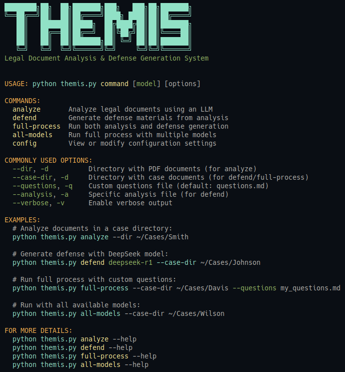

# Themis

Themis - imparting wisdom on the principles of law and justice



## Legal Analysis System

A comprehensive system for analyzing legal case documents and generating defense materials using Large Language Models (LLMs) via Ollama.

## Overview

This system processes legal documents in a two-step workflow:

1. **Document Analysis**: Extracts text from PDFs and analyzes them using customizable legal questions
2. **Defense Generation**: Creates a comprehensive defense strategy, action items, and timeline based on the analysis

## Requirements

- Python 3.8+
- PyPDF2
- requests
- tqdm (for progress bars)
- colorama (for colored output)
- An Ollama server running with LLMs

### Optional Requirements

- tesseract-ocr and pytesseract (for OCR support with scanned PDFs)
- pdf2image (for converting PDFs to images for OCR)

## Limitations

- The current version extracts text directly from PDFs using PyPDF2, which works well for text-based PDFs but cannot extract text from scanned documents
- If you need to analyze scanned PDF documents, consider adding OCR functionality (see below)

## Setup

### Virtual Environment

```bash
# Create a virtual environment (if not already created)
cd Themis
python -m venv legalenv

# Activate the virtual environment
source legalenv/bin/activate

# Install required packages
pip install PyPDF2 requests tqdm colorama
```

### Configuring Ollama

By default, Themis is configured to connect to an Ollama server running on localhost (http://localhost:11434). You can connect to a remote Ollama server in two ways:

1. Command-line options:
   ```bash
   python themis.py --ollama-host 192.168.1.100 --ollama-port 11434 analyze --dir ~/Legal/MyCase/
   ```

2. Configuration file:
   The first time you run Themis with specific options, a configuration file is automatically created at `~/.themis/themis.cfg`. This saves your settings including model preferences and Ollama server details, allowing you to run subsequent commands without repeating these options.

You can view or reset your configuration with:
```bash
python themis.py config --show   # Show current configuration
python themis.py config --reset  # Reset to defaults
```

## Main Script Overview

### themis.py

A unified script that provides both document analysis and defense generation functionality.

#### Key Features:

- External questions file for easy customization
- Caching system to avoid re-analyzing documents
- Real-time progress display
- Organized log and output file structure
- Can reload questions between documents for on-the-fly adjustments
- Synthesizes information across all documents
- Generates comprehensive defense materials
- Clear progress display

## File Organization

The system organizes files within your specified case directory:

```
YOUR_CASE_DIR/                           # Your specified case directory
  ├── *.pdf                              # Source PDF documents
  ├── document_analysis_modelname.json   # Analysis results (root level copy)
  ├── logs/                              # Log directory within case directory
  │   └── YYYYMMDD_modelname/            # Date and model-specific logs
  │       ├── case_analysis.log          # Analysis log file
  │       ├── analysis_cache.json        # Cache to speed up repeat runs
  │       ├── document_analysis_modelname.json  # Analysis results
  │       └── defense_materials/         # Generated defense materials
  │           ├── defense_strategy.md
  │           ├── action_items.md
  │           └── case_timeline.md
  └── Defense-YYYYMMDD-modelname/        # Copy of defense materials for easy access
      ├── defense_strategy.md
      ├── action_items.md
      └── case_timeline.md
```

## How to Use

### Step 1: Customize Questions (Optional)

The system comes with a default `questions.md` file that contains questions specifically designed for legal document analysis. You can customize these questions by editing this file:

```markdown
# Questions for Legal Document Analysis

1. What are the central claims or charges against the defendant in this document?
2. What key evidence is presented to support these allegations?
   ...
```

If the questions.md file cannot be found, the system falls back to built-in default questions.

You can edit the questions file even while the analyzer is running - changes will apply to the next document.

### Step 2: Run Themis

```bash
python themis.py command [model] [options]
```

#### Commands:

- `analyze`: Perform document analysis
- `defend`: Generate defense materials
- `full-process`: Perform both analysis and defense generation
- `config`: View or modify configuration settings

#### Required Arguments:

- `--dir` or `-d`: Directory containing PDF documents (for analyze)
- `--case-dir` or `-d`: Directory containing case documents (for defend and full-process)

#### Optional Arguments:

- `model`: Specify the Ollama model to use (default: from configuration or "mistral")
- `--ollama-host`: Specify the Ollama server hostname or IP (default: "localhost")
- `--ollama-port`: Specify the Ollama server port (default: 11434)
- `--questions` or `-q`: Specify the questions file to use
- `--analysis` or `-a`: Path to a specific analysis file (for defend command)
- `--verbose` or `-v`: Enable verbose output

## Examples

### Basic Usage

```bash
# Activate the virtual environment
cd Themis
source legalenv/bin/activate

# Run full analysis and defense generation on a specific case directory:
python themis.py full-process --case-dir MyCase/

# Just analyze documents in a case directory:
python themis.py analyze --dir MyCase/

# Just generate defense materials for a case:
python themis.py defend --case-dir MyCase/
```

### Using a Different Model

```bash
# Run with the deepseek-r1 model:
python themis.py full-process deepseek-r1 --case-dir MyCase/

# Analyze only with deepseek-r1:
python themis.py analyze deepseek-r1 --dir MyCase/
```

### Custom Options

```bash
# Analyze with custom questions file:
python themis.py analyze --dir MyCase/ --questions my_questions.md

# Generate defense using a specific analysis file:
python themis.py defend --case-dir MyCase/ --analysis MyCase/custom_analysis.json
```

### Advanced Options

```bash
# Connect to a remote Ollama server:
python themis.py --ollama-host 192.168.1.100 analyze --dir ~/Legal/MyCase/

# Generate defense with a specific model and Ollama server:
python themis.py --ollama-host api.example.com --ollama-port 8000 defend deepseek-r1 --case-dir ~/Legal/MyCase/

# Show current configuration:
python themis.py config --show

# Reset to default configuration:
python themis.py config --reset
```

## Output Files

### Analysis Output

The analysis results are structured as a JSON file containing:

- Document filename
- Answers to each question in the questions file

### Defense Materials

1. **defense_strategy.md**: Comprehensive legal defense strategy

    - Key defense arguments
    - Weaknesses in the prosecution's case
    - Counter-arguments
    - Evidence suggestions
    - Legal precedents
    - Strategic recommendations

2. **action_items.md**: Specific tasks for the defense team

    - Evidence collection tasks
    - Witness interviews needed
    - Legal research requirements
    - Motion filing deadlines
    - Expert consultation needs

3. **case_timeline.md**: Chronological sequence of events
    - Key dates and events
    - Filing deadlines
    - Procedural dates
    - Relevant historical events

## Advanced Features

### Caching System

The analyzer maintains a cache of analysis results to avoid redundant processing:

- Cache is stored in `logs/YYYYMMDD_modelname/analysis_cache.json`
- Documents that have already been analyzed with the same questions will use cached results
- You can delete this file to force reanalysis of all documents

### Real-time Question Updates

You can modify the questions file while the analyzer is running:

- Questions are reloaded before each document is processed
- This allows you to refine your questions based on what you see in previous results
- Especially useful for long batches of documents

### Multiple Models

You can analyze the same documents with different LLMs:

- Each model's results are stored separately
- Allows comparing analysis across different models
- Can generate defense materials using your preferred model

## Adding OCR Support

The current version of Themis cannot process scanned PDFs that don't contain extractable text. To add OCR support:

1. Install the required packages:
   ```bash
   sudo apt-get install tesseract-ocr poppler-utils
   pip install pytesseract pdf2image pillow
   ```

2. Extend the `extract_text_from_pdf` function in `themis_lib/utils.py` to use OCR when needed:
   ```python
   def extract_text_from_pdf(pdf_path, use_ocr=False):
       # Existing code...
       
       # If no text found or OCR explicitly requested
       if use_ocr or len(text.strip()) < 100:
           try:
               from pdf2image import convert_from_path
               import pytesseract
               
               print_status(f"Using OCR to extract text from {pdf_path.name}", Fore.YELLOW)
               images = convert_from_path(pdf_path, dpi=300)
               ocr_text = ""
               
               for i, image in enumerate(tqdm(images, desc="OCR Processing", unit="page")):
                   page_text = pytesseract.image_to_string(image)
                   ocr_text += page_text + "\n"
                   
               print_status(f"OCR extracted {len(ocr_text)} characters from {pdf_path.name}", Fore.GREEN)
               return ocr_text
           except ImportError:
               print_status("OCR libraries not found. Install with: pip install pytesseract pdf2image", Fore.RED)
               return text
           except Exception as e:
               print_status(f"OCR error: {str(e)}", Fore.RED)
               return text
       
       return text
   ```

3. Add an `--ocr` command-line option to the analyze command:
   ```python
   analyze_parser.add_argument('--ocr', action='store_true', help='Use OCR for text extraction from PDFs')
   ```

## Notes

- The colorized terminal output enhances readability of progress and status information
- Both scripts handle interruptions gracefully (Ctrl+C)
